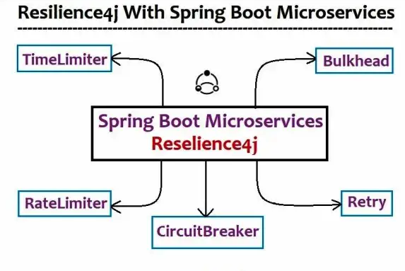

# Spring boot Resilience4j Example 

---




## [springboot-resilience4j-rate-limiter](./APPLICATIONS/springboot-resilience4j-rate-limiter)

## [springboot-resilience4j-retry](./APPLICATIONS/springboot-resilience4j-retry)

## [springboot-resilience4j-circuit-breaker](./APPLICATIONS/springboot-resilience4j-circuit-breaker)

## [springboot-resilience4j-bulkhead](./APPLICATIONS/springboot-resilience4j-bulkhead)

## [springboot-resilience4j-time-limiting](./APPLICATIONS/springboot-resilience4j-time-limiting)


## Fault Tolerance in Microservices
> Fault Tolerance is a technique of tolerating a fault. A Microservice that tolerates the fault is known as Fault Tolerant. Moreover, a 
> Microservice should be a fault tolerant in such a way that the entire application runs smoothly

## modules of Resilience4j
* resilience4j-circuitbreaker: Circuit breaking
* resilience4j-ratelimiter: Rate limiting
* resilience4j-bulkhead: Bulkheading
* resilience4j-retry: Automatic retrying (sync and async)
* resilience4j-cache: Result caching
* resilience4j-timelimiter: Timeout handling


---

### Rate Limiting
``` 
Rate Limiter limits the number of requests for a given 
Rate Limiter never talks about concurrent requests,
```

### Sample code 
```

@RateLimiter(name = "dataRateLimit", fallbackMethod = "dataRateLimitFallBack")
public String servData(){

	return "XXXX";


public String dataRateLimitFallBack(Exception e){

  return "XXXX";
}

```

### Configuration 
```
resilience4j:
  ratelimiter:
    instances:
      dataRateLimit:
        limit-for-period: 2
        limit-refresh-period: 10s
        timeout-duration: 0
```
* or 
```
resilience4j.ratelimiter.instances.dataRateLimit.limit-for-period=2
resilience4j.ratelimiter.instances.dataRateLimit.limit-refresh-period=5s
resilience4j.ratelimiter.instances.dataRateLimit.timeout-duration=0
```

---

### Retry
```
Microservice ‘A’  depends on another Microservice 
Microservice ‘B’ is a faulty service and its success rate is only upto 50-60%.
fault may be due to any reason, such as service is unavailable, buggy service that sometimes responds and sometimes not, or an intermittent network failure etc.
if Microservice ‘A’ retries to send request 2 to 3 times, the chances of getting response increases
```

### Sample code 
```
@Retry(name = "dataRetry", fallbackMethod = "dataRetryFallBack")
public String servData(){

	return "XXXX";


public String dataRetryFallBack(Exception e){

  return "XXXX";
}
```

### Configuration 
```
resilience4j:
  retry:
    instances:
      dataRetry:
        enable-exponential-backoff: true
        max-attempts: 5
        retry-exceptions: org.springframework.web.client.ResourceAccessException
        wait-duration: 2s
```
* or
```
resilience4j.retry.instances.dataRetry.max-attempts=5
resilience4j.retry.instances.dataRetry.wait-duration=2s
resilience4j.retry.instances.dataRetry.retry-exceptions=org.springframework.web.client.ResourceAccessException
```

---

### Circuit Breaker
```
‘Breaking the Circuit’.
Microservice ‘A’ is internally calling another Microservice ‘B’ and ‘B’ has some fault.
calling the faulty Microservice ‘B’. again and again Instead, we call a dummy method that is called a ‘Fallback Method’. 
Therefore, calling a fallback method instead of an actual service due to a fault is called breaking the circuit
there are generally three states of a Circuit Breaker Pattern : Closed, Open, Half Open.
```
* Closed:=>  Microservice calls the dependent Microservice continuously, and dependent service is responding properly 
* Open :=>   MicroService doesn’t call the dependent Microservice, Instead, it calls the fallback method
* Half-open :=> Microservice sends a percentage of requests to dependent Microservice and the rest of them to Fallback method


### Sample code 
```
@CircuitBreaker(name = "dataCircuitBreaker", fallbackMethod = "dataCircuitBreakerFallBack")
public String servData(){

	return "XXXX";


public String dataCircuitBreakerFallBack(Exception e){

  return "XXXX";
}

```

### Configuration 
```
resilience4j:
  circuitbreaker:
    instances:
      dataCircuitBreaker:
        automatic-transition-from-open-to-half-open-enabled: true
        failure-rate-threshold: 80
        minimum-number-of-calls: 5
        permitted-number-of-calls-in-half-open-state: 4
        sliding-window-size: 10
        sliding-window-type: COUNT_BASED
        wait-duration-in-open-state: 10s
```
* or 
```
resilience4j.circuitbreaker.instances.dataCircuitBreaker.failure-rate-threshold=80
resilience4j.circuitbreaker.instances.dataCircuitBreaker.sliding-window-size=10
resilience4j.circuitbreaker.instances.dataCircuitBreaker.sliding-window-type=COUNT_BASED
resilience4j.circuitbreaker.instances.dataCircuitBreaker.minimum-number-of-calls=5
resilience4j.circuitbreaker.instances.dataCircuitBreaker.automatic-transition-from-open-to-half-open-enabled=true
resilience4j.circuitbreaker.instances.dataCircuitBreaker.permitted-number-of-calls-in-half-open-state=4
resilience4j.circuitbreaker.instances.dataCircuitBreaker.wait-duration-in-open-state=1s

```

---


### Bulkhead 
```
In the context of the Fault Tolerance mechanism, if we want to limit the number of concurrent requests, 
we can use Bulkhead as an aspect. Using Bulkhead, we can limit the number of concurrent requests within a particular period
```


### Sample code 
```
@Bulkhead(name = "dataBulkhead", fallbackMethod = "dataBulkheadFallBack")
public String servData(){

	return "XXXX";


public String dataBulkheadFallBack(Exception e){

  return "XXXX";
}

```


### Configuration 
```
resilience4j:
  bulkhead:
    instances:
      dataBulkhead:
        max-concurrent-calls: 5
        max-wait-duration: 0
```
* or 
```
resilience4j.bulkhead.instances.dataBulkhead.max-concurrent-calls=5
resilience4j.bulkhead.instances.dataBulkhead.max-wait-duration=0
```

---

### Time Limiting or Timeout Handling
```
Time Limiting is the process of setting a time limit for a Microservice to respond
```


### Sample code 
```
@TimeLimiter(name = "dataTimeLimiter", fallbackMethod = "dataTimeLimiterFallBack")
public String servData(){

	return "XXXX";


public String dataTimeLimiterFallBack(Exception e){

  return "XXXX";
}
```

### Configuration 
```
resilience4j:
  timelimiter:
    instances:
      dataTimeLimiter:
        cancel-running-future: false
        timeout-duration: 1s
```

* or 
```
resilience4j.timelimiter.instances.dataTimeLimiter.timeout-duration=1ms
resilience4j.timelimiter.instances.dataTimeLimiter.cancel-running-future=false
```

---